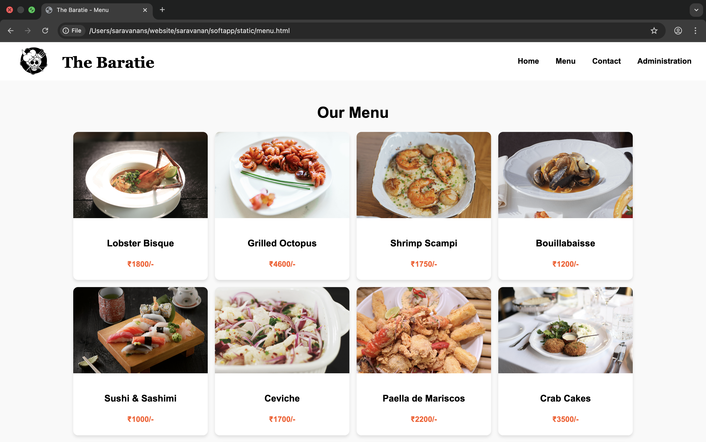
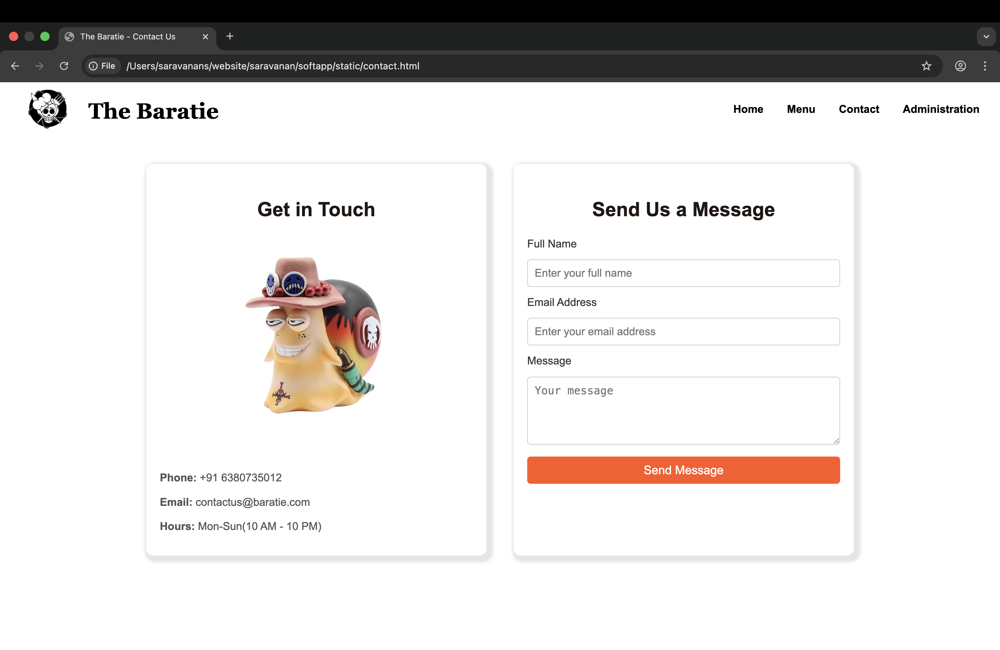
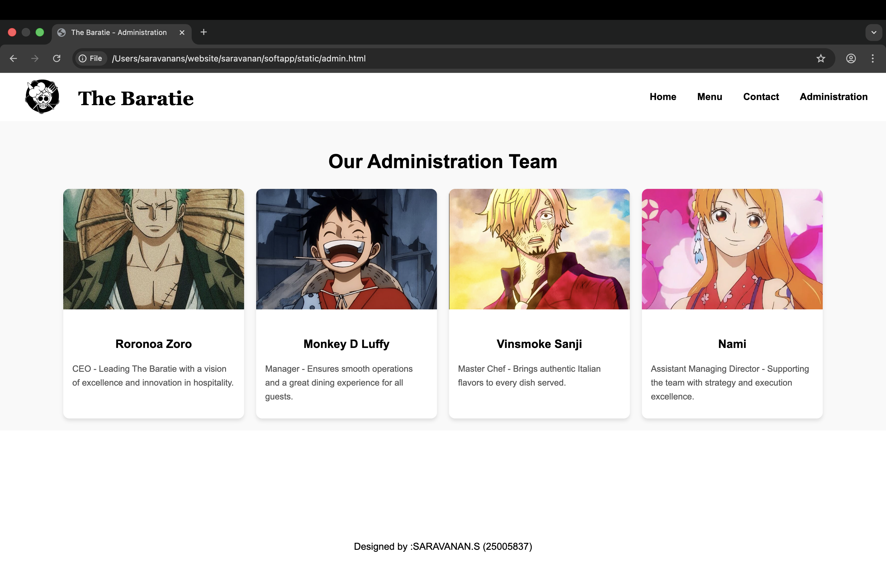

# Ex.07 Restaurant Website
# Date:05.10.2025
# AIM:
To develop a static Restaurant website to display the food items and services provided by them.

# DESIGN STEPS:
## Step 1:
Requirement collection.

## Step 2:
Creating the layout using HTML and CSS.

## Step 3:
Updating the sample content.

## Step 4:
Choose the appropriate style and color scheme.

## Step 5:
Validate the layout in various browsers.

## Step 6:
Validate the HTML code.

## Step 7:
Publish the website in the given URL.

# PROGRAM:
~~~

HOME.HTML

<!DOCTYPE html>
<html lang="en">
<head>
    <meta charset="UTF-8">
    <meta name="viewport" content="width=device-width, initial-scale=1.0">
    <title>The Baratie</title>
    
</head>
<body>

    <header>
        

            
            
<h1 >The Baratie</h1>

        

        
            <nav>
                <a href="home.html">Home</a>
                <a href="menu.html">Menu</a>
                <a href="contact.html">Contact</a>
                <a href="admin.html">Administration</a>
           </nav>
        
    </header>
    
 
    

        

            <h1>Welcome to THE BARATIE</h1>
            
Where the Ocean Meets Your Plate, and Every Meal is an Adventure.

            <a href="#features">Explore Now</a>
        

    

    <section id="features" class="features">
        

            
            <h3>Stunning Ocean Views</h3>
            
Dine with breathtaking panoramic views of the ocean, where every meal is paired with stunning sunsets and serene seascapes.

        

        

            
            <h3>Unique Nautical Ambiance</h3>
            
Immerse yourself in a cozy maritime ambiance, complete with elegant nautical decor and the charm of the sea.

        

        

            
            <h3>Signature Seafood</h3>
            
Savor the freshest catch, beautifully displayed and expertly prepared to celebrate the flavors of the ocean.

        

    </section>

    <footer>
        
Designed by :SARAVANAN.S(25005837)

    </footer>

</body>
</html>

MENU.HTML

<!DOCTYPE html>
<html lang="en">
<head>
    <meta charset="UTF-8">
    <meta name="viewport" content="width=device-width, initial-scale=1.0">
    <title>The Baratie - Menu</title>
    
</head>
<body>

    <header>
        

            
            
<h1 >The Baratie</h1>

        

        
            <nav>
                <a href="home.html">Home</a>
                <a href="menu.html">Menu</a>
                <a href="contact.html">Contact</a>
                <a href="admin.html">Administration</a>
           </nav>
        
    </header>

    

        <h1>Our Menu</h1>
        

            

                
                

                    <h3>Lobster Bisque</h3>
                    
₹1800/-

                

            

            

                
                

                    <h3>Grilled Octopus</h3>
                    
₹4600/-

                

            

            

                
                

                    <h3>Shrimp Scampi</h3>
                    
₹1750/-

                

            

            

                
                

                    <h3>Bouillabaisse</h3>
                    
₹1200/-

                

            

            

                
                

                    <h3> Sushi & Sashimi</h3>
                    
₹1000/-

                

            

            

                
                

                    <h3>Ceviche</h3>
                    
₹1700/-

                

            

            

                
                

                    <h3> Paella de Mariscos</h3>
                    
₹2200/-

                

            

            

                
                

                    <h3>Crab Cakes</h3>
                    
₹3500/-

                

            

            

                
                

                    <h3>Fish Tacos</h3>
                    
₹1450/-

                

            

            

                
                

                    <h3>Salmon Teriyaki</h3>
                    
₹2200/-

                

            

            

                
                

                    <h3>Jambalaya</h3>
                    
₹2500/-

                

            

            

                
                

                    <h3>Chilli Crab</h3>
                    
₹2600/-

                

            

        

    

    <footer>
        
Designed by :SARAVANAN.S(25005837)

    </footer>

</body>
</html>

CONTACT.HTML

<!DOCTYPE html>
<html lang="en">
<head>
    <meta charset="UTF-8">
    <meta name="viewport" content="width=device-width, initial-scale=1.0">
    <title>The Baratie - Contact Us</title>
    
</head>
<body>

    <header>
        

            
            
<h1 >The Baratie</h1>

        

        
            <nav>
                <a href="home.html">Home</a>
                <a href="menu.html">Menu</a>
                <a href="contact.html">Contact</a>
                <a href="admin.html">Administration</a>
           </nav>
        
    </header>

    

     
    

    <section class="contact-section">
        

            <h2>Get in Touch</h2>
            
            
<strong>Phone:</strong> +91 6380735012

            
<strong>Email:</strong> contactus@baratie.com

            
<strong>Hours:</strong> Mon-Sun(10 AM - 10 PM)

        

        

            <h2>Send Us a Message</h2>
            <form action="/submit-contact" method="POST">
                <label for="name">Full Name</label>
                <input type="text" id="name" name="name" placeholder="Enter your full name" required>

                <label for="email">Email Address</label>
                <input type="email" id="email" name="email" placeholder="Enter your email address" required>

                <label for="message">Message</label>
                <textarea id="message" name="message" placeholder="Your message" required></textarea>

                <button type="submit">Send Message</button>
            </form>
        

    </section>

    <footer>
        
Designed by :SARAVANAN.S(25005837)

    </footer>

</body>
</html>

ADMIN.HTML

<!DOCTYPE html>
<html lang="en">
<head>
    <meta charset="UTF-8">
    <meta name="viewport" content="width=device-width, initial-scale=1.0">
    <title>The Baratie</title>
    
</head>
<body>

    <header>
        

            
            
<h1 >The Baratie</h1>

        

        
            <nav>
                <a href="home.html">Home</a>
                <a href="menu.html">Menu</a>
                <a href="contact.html">Contact</a>
                <a href="admin.html">Administration</a>
           </nav>
        
    </header>
    
 
    

        

            <h1>Welcome to THE BARATIE</h1>
            
Where the Ocean Meets Your Plate, and Every Meal is an Adventure.

            <a href="#features">Explore Now</a>
        

    

    <section id="features" class="features">
        

            
            <h3>Stunning Ocean Views</h3>
            
Dine with breathtaking panoramic views of the ocean, where every meal is paired with stunning sunsets and serene seascapes.

        

        

            
            <h3>Unique Nautical Ambiance</h3>
            
Immerse yourself in a cozy maritime ambiance, complete with elegant nautical decor and the charm of the sea.

        

        

            
            <h3>Signature Seafood</h3>
            
Savor the freshest catch, beautifully displayed and expertly prepared to celebrate the flavors of the ocean.

        

    </section>

    <footer>
        
Designed by :SARAVANAN.S(25005837)

    </footer>

</body>
</html>

~~~

# OUTPUT:

# RESULT:
The program for designing software company website using HTML and CSS is completed successfully.
